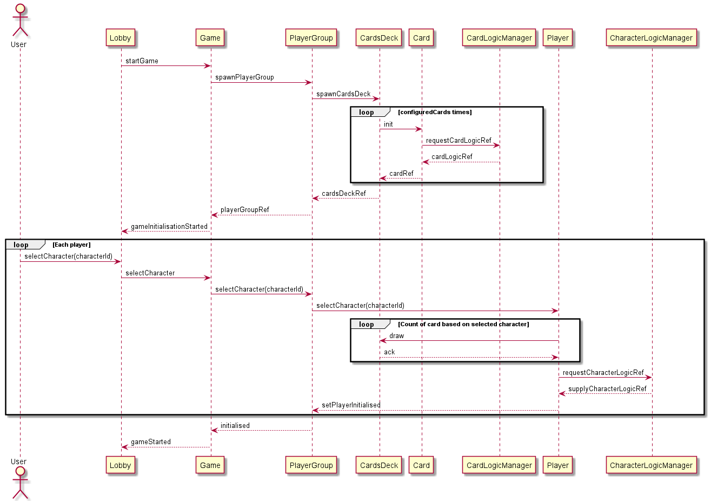

## Bang! (card game)

An implementation of Wild West-themed social deduction card game designed by Emiliano Sciarra, built with Scala, Akka and Lagom.

## Project Status

This project is currently in early development.

## Installation and Setup Instructions

tbd

## Design
### Class diagram

### Sequence diagram

#### Game initialization diagram
